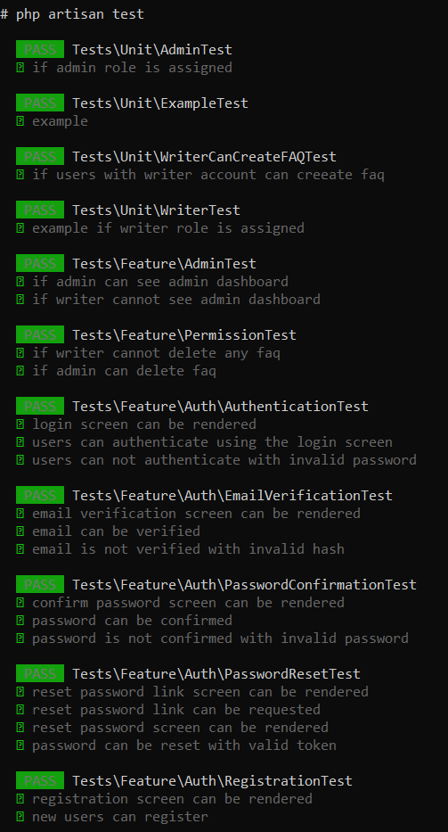
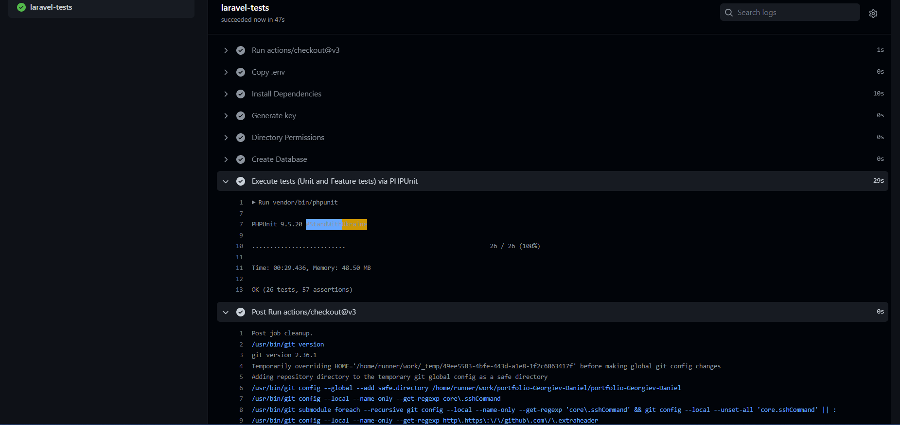

# 4 - Testing

## Test Plan

### User stories:

- As an administrator, I want to be the only one who has permission to the admin dashboard so that I can manage roles, permissions, and users.

**Happy Path:** 

GIVEN that I have an administrator account 

WHEN I log in with that account

THEN I can access the administrator dashboard so that I can mange roles, permissions, and users.

**Unhappy path:**

GIVEN I have a user’s account 

WHEN I log in with that account

THEN I can still access the administrator dashboard and manage roles, permissions, users.

**System Test:** 

The system tests check: 

1. If a user with the role of admin is logged in and visits `/` he can see the “Admin Page” link in the navbar.
2. If the user with the role of admin can access the `admin.index` route.
3. If a user with the role of writer(anything except “admin”) is logged in and and visits `/` he **cannot**  see the “Admin Page” link in the navbar
4. If the user with the role of writer **cannot** access the `admin.index` route 

The testing for the **Happy Path** can be found in the `test_if_admin_can_see_admin_dashboard` function in `AdminDashboardTest`.

The testing for the **Unhappy Path** can be found in the `test_if_writer_cannot_see_admin_dashboard` function in `AdminDashboardTest`.

**Unit Test:** 

The unit test checks: 

1. When the role of admin is assigned to an account that in fact the connection between that account and the “admin” role is made.

The Unit Test can be found in `test_if_admin_role_is_assigned` function in `AdminTest`

---

- As an administrator, I want to be the only one who has permission to delete FAQs, so that I can manage what content is displayed on my website

**Happy Path:**

GIVEN that I have and administrator’s account 

WHEN a writer creates and FAQ

THEN I want to be the only one who has permission to remove that FAQ

**Unhappy Path:** 

GIVEN that I have a writer’s account 

WHEN I create an FAQ 

THEN I am the one who has permissions to delete that FAQ

**System Test:**

The System test checks:

1. If when a user has the “writer” role assigned he can store FAQs to the database 
2. If when a user has the “writer” role assigned and has created an FAQ he cannot ‘destroy’ that FAQ
3. If when a user has the “admin” role assigned he can “destroy” any FAQ that he wishes.

The testing for the **Happy Path** can be found in `test_if_admin_can_delete_faq` in the `AdminDeletePermissionTest`

The testing for the **Unhappy Path** can be found in `test_if_writer_cannot_delete_any_faq` in the `AdminDeletePermissionTest`

**Unit Test:** 

The Unit Test checks:

1. When the role of writer is assigned to an account that in fact the connection between that account and the “writer” role is made.

The test for the unit test can be found in the `WriterTest` in the `test_if_writer_role_is_assigned` function

---

- As a writer, I want to be the only one who has permission to edit the FAQs that I create, so that others cannot edit my FAQs

**Happy Path:**

GIVEN that I have a writer’s account and I am logged in

WHEN I create an FAQ 

THEN  I am the only one who has permission to edit that FAQ

**Unhappy Path:**

GIVEN that I have a writer’s account and I am logged in

WHEN I create and FAQ

THEN other users who have writer’s permissions can edit my FAQ

**System Test:**

The System Test checks:

1. If when a user has the “writer” role assigned he can store FAQs to the database 
2. If when another user that also has the role of “writer” creates a different FAQs and stores it to the database, both users can edit their own individual FAQs, but they cannot edit the FAQ of any other user.

The testing for the **Happy Path** can be found in the `WriterEditPermissionTest` in the function `test_if_writer_can_create_faq`

The testing for the **Unhappy Path** can be found in the `WriterEditPermissionTest` in the function `test_if_writer_can_edit_only_the_faq_he_created`

**Unit Test:**

The Unit Test checks: 

1. If the `/faq` page can be accessed 
2. When a users is assigned the role of writer and he visits the `/faq` he can access the link to “Add FAQ” at the bottom of the page.

The unit test logic can be found in the `WriterCanCreateFAQTest` in the `test_if_users_with_writer_account_can_creeate_faq` function.

## Screen Shot

## Evaluation

- The possible mistakes that can be detected by my tests are:
    - We do not want users to have permissions to edit other users database entries.
    - We do not want users to be able to delete database entries, only the admin should be able to do that.
    - We do not want users to have access to the `admin.index` because it shows valuable and sensitive data that they should not be able to access or manipulate.
- The possible mistakes that cannot be detected by my tests are:
    - My tests do not check if the users has permission to grand him/her self administrator properties.
- I can conclude that everything ‘works correctly’ because my tests cover all the basic functions of roles and permissions and I double-check after every action, for example, when an FAQ is created, I assert that the database in fact contains that FAQ. I tried to add as much of these in between assertions as I could without repeating myself. Furthermore, all my tests pass without any error, and given that I am testing basic functionality and using simple logic and assertions, I can conclude that the functionality that I intended to test is being tested. I think one possible improvement would be to restrict the `/register` path only for the admin, so that not everyone can register and add as many FAQs as they want. Similarly, another improvement that I plan on including in my project is to restrict the amount of FAQs an account can create, so that one account cannot add an infinite amount of database entries.

## Proof for **Test effectivity**

